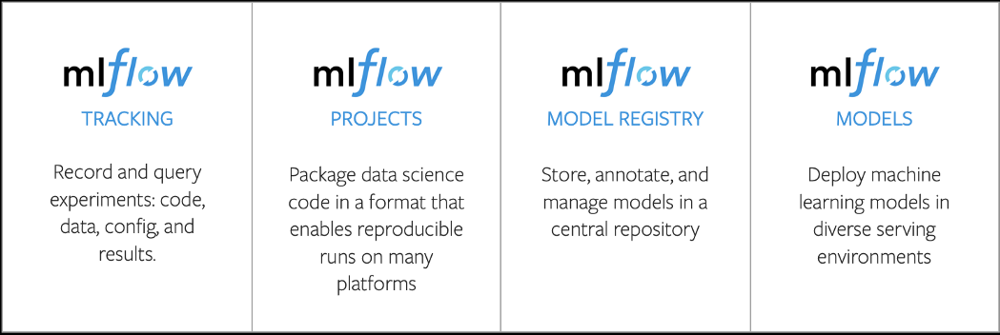

## MLflow workshop

De MLflow workshop is ontwikkeld in opdracht van het Centraal Justitieel Incassobureau (CJIB).

Het belangrijkste doel van de workshop is om kennis te maken met een aantal belangrijke componenten in iedere machine learning architectuur:
* experiment tracking,
* model packaging, 
* model repository en 
* model deployment (online en offline predicties). 

Daarnaast willen we meer leren over MLflow en het MS Azure Databricks platform. In onderstaande afbeelding zie je de onderdelen van MLflow waarmee we in de hackathon aan de slag gaan.

Zijdelings komen ook REST API's, Postman en de mogelijkheden voor het uitvoeren van Python code in de RStudio IDE aan bod.

#### Programma 

#### Presentaties
* [Landschap en tools](pdf/landschap_en_tools.pdf)
* [Een model in productie](pdf/een_model_in_productie.pdf)

#### Hands-on sessies
* [Voorbereiding](markdown/0-prep.md)
* Hands-on 1: [MLflow Tracking](markdown/1-tracking.md)
* Hands-on 2: [MLflow Projects](markdown/2-projects.md)
* Hands-on 3: [Mlflow Models & Model Registry](markdown/3-models.md)
* Hands-on 4: [Advanced topics](markdown/4-advanced.md)

Uitwerkingen van de oefeningen:
* [Hands-on 1](R/1-tracking-solution.R)
* [Hands-on 2](R/2-projects.R)
* [Hands-on 4](R/3-models.R)
* [Hands-on 4](R/4-advanced-solution.R)

