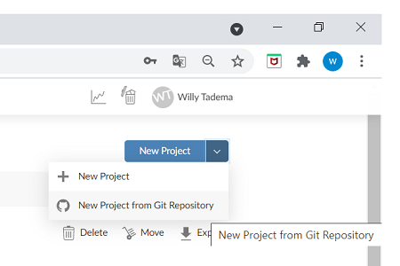
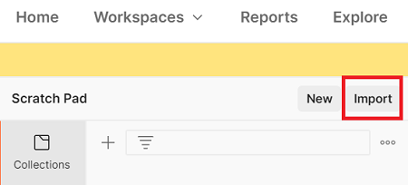
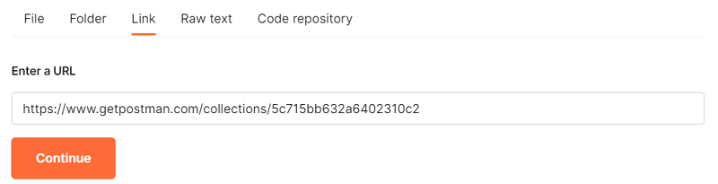
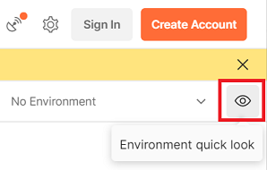
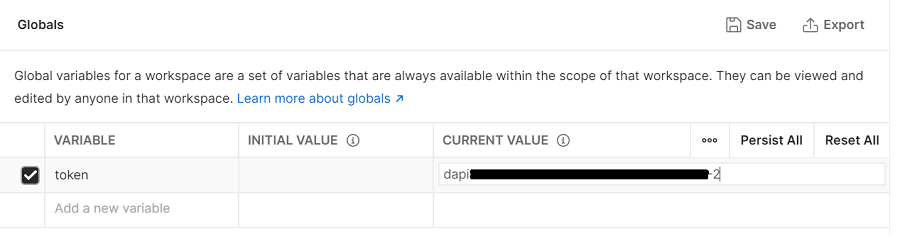

## Voorbereiding

### 0.1 Maak een gratis RStudio Cloud account aan
Ga naar https://rstudio.cloud en maak een gratis account aan.

### 0.2 Maak een token aan in de MS Azure Databricks omgeving
* Log in op onze omgeving op MS Azure Databricks. De URL en credentials worden tijdens de workshop verstrekt.
* Klik rechtsboven op de knop _Databricks_ en kies in het snelmenu voor _User Settings_.
* Klik op _Generate New Token_.
* Noteer het token of kopieer het naar een tekstbestand.

### 0.3 Maak een nieuw project aan
* Ga naar RStudio Cloud.
* Selecteer _Your Workspace_.
* Kies voor _New Project from Git Repository_. 



* Vul deze URL in: https://github.com/RIG-MYCELIA/mlflow-workshop
* Installeer de benodigde packages: 
```
install.packages(c("rpart", "partykit", "carrier", "mlflow", "reticulate", "usethis", "httr", "jsonlite", "class"))
```

### 0.5 Installeer MLflow
* Installeer conda:
```
reticulate::py_discover_config()
```
* Antwoord `Y` op de vraag `Would you like to install Miniconda?`
* Installeer MLflow in de Python-omgeving:
```
mlflow::install_mlflow("3.9")
```
* Open het `.Renviron` bestand.
```
usethis::edit_r_environ()
```
* Voeg onderstaande code voor het aanmaken van omgevingsvariabelen toe aan `.Renviron`. Let op: vul je eigen MS Azure Databricks token in!
```
RETICULATE_PYTHON = "/home/rstudio-user/.local/share/r-miniconda/envs/r-mlflow-1.18.0/bin/python"
MLFLOW_PYTHON_BIN = "/home/rstudio-user/.local/share/r-miniconda/envs/r-mlflow-1.18.0/bin/python"
MLFLOW_BIN = "/home/rstudio-user/.local/share/r-miniconda/envs/r-mlflow-1.18.0/bin/mlflow"
MLFLOW_TRACKING_URI = "databricks"
DATABRICKS_HOST = "<URL MS Azure Databricks omgeving>"
DATABRICKS_TOKEN = "<jouw token>"
```
* Herstart R. Check of de omgevingsvariabelen zijn aangemaakt.
```
Sys.getenv("RETICULATE_PYTHON")
Sys.getenv("MLFLOW_PYTHON_BIN")
Sys.getenv("MLFLOW_BIN")
Sys.getenv("MLFLOW_TRACKING_URI")
Sys.getenv("DATABRICKS_HOST")
Sys.getenv("DATABRICKS_TOKEN")
```

### 0.6 Installeer Postman
* Ga naar de website http://www.getpostman.com/downloads. Klik op _Download the App_ en installeer de versie van Postman die geschikt is voor jouw besturingssysteem.
* Klik op _Skip and go to the app_.
* Klik in _Scratch Pad_ op _Import_.



* Selecteer _Link_ en kopieer de volgende URL naar het tekstvak: https://www.getpostman.com/collections/5c715bb632a6402310c2. Klik op _Continue_.



* Laat alle instellingen ongewijzigd en klik op _Import_.
* Klik op _Environment quick look_. 



* Ga naar het _Global_ panel en klik op _Add_.
* Maak een variabele aan met de naam `token`. Laat `INITIAL VALUE` leeg. Kopieer het Databricks token naar het veld `CURRENT VALUE`. Klik op _Save_.



