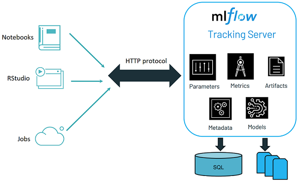

## MLflow Tracking

### 1.1 Wat is MLflow Tracking?
In een machine learning project train je als data scientist altijd meerdere modellen. Vaak tientallen en soms wel honderden! Hoe houd je dan het overzicht? En hoe verantwoord je achteraf langs welke weg je uiteindelijk tot het definitieve model bent gekomen? MLflow Tracking helpt je met deze vragen. MLflow Tracking is namelijk een oplossing voor _experiment management_. 

Voordat je met MLflow Tracking aan de slag kunt, moet je eerst een aantal begrippen kennen:
* __Parameters__: _key-value pairs_ met inputwaarden voor de code
* __Metrics__: _key-value pairs_ met numerieke indicatoren
* __Artifacts__: bestanden met data, modellen of andere informatie
* __Run__: een instantie van de code
* __Tags__: _key-value pairs_ met aanvullende informatie over een run
* __Experiment__: een verzameling van runs

De experimenten worden opgeslagen in een tracking server. In ons geval draait de tracking server op het MS Azure Databricks platform in de cloud.



### 1.2 Verbinding maken met de tracking server

Om aan de slag te gaan met MLflow Tracking, moet je eerst het {mlflow} package laden. Daarna kun je bijvoorbeeld een overzicht van experimenten opvragen met de functie `mlflow_list_experiments()`.

```
library(mlflow)
mlflow_list_experiments()
```

Zoals je ziet, heeft ieder experiment heeft een unieke naam en een identificatienummer. 

#### Oefening:     
Gebruik de functie `mlflow_get_experiment()` om de gegevens van een specifiek experiment op te vragen.    

### 1.3 Experiment aanmaken

Het aanmaken van een experiment is eenvoudig. Daarvoor gebruik je de functie `mflow_create_experiment()`. 

```
mlflow_create_experiment("/Shared/<jouw naam>")
```
De functie retourneert het identificatienummer van het nieuwe experiment.

Met de functie `mlflow_set_experiment()` kun je aangeven onder welk experiment je runs standaard wilt loggen. Je kunt de naam van het experiment meegeven als argument van de functie. Iedere keer als je een nieuwe R sessie start, moet je opnieuw het standaard experiment instellen.
```
mlflow_set_experiment(experiment_name = "/Shared/<jouw naam>")
```
Je kunt er ook voor kiezen om het identificatienummer mee te geven.
```
mlflow_set_experiment(experiment_id = <id van jouw experiment>)
```

#### Oefening
1. Maak een nieuw experiment aan met `mlflow_create_experiment()`.     
2. Initialiseer het zojuist aangemaakte experiment als _default_ voor het loggen.
3. Check in de MS Azure Databricks omgeving dat het experiment is aangemaakt.

### 1.4 Run starten

Binnen één experiment kunnen meerdere runs gedraaid worden. Elke run heeft zijn eigen parameters, metrics en artifacts. Voor het starten van een nieuwe run kun je de functie `mlflow_start_run()` gebruiken. Deze functie retourneert informatie over de nieuwe, actieve run.


```
run <- mlflow_start_run()
run$run_id
run$start_time
run$status
```

Je kunt op ieder moment checken of er een run actief is met de functie `mlflow_get_run()`.

```
run <- mlflow_get_run()
run$run_id
run$start_time
run$status
```

#### Oefening
Let op: Zorg dat je een _default_ experiment gekozen hebt met `mlflow_set_experiment()`.
1. Start een run met `mlflow_start_run()`.
2. Vraag het id van de actieve run op.
3. Check in de MS Azure Databricks omgeving dat er een run met het betreffende id is aangemaakt.

### 1.5 Run be&euml;indigen

Zo lang je een run niet expliciet be&euml;indigd, blijft deze actief. Er kan maar één run tegelijk actief zijn. Het be&euml;indigen van een run doe je met `mlflow_end_run()`.

```
run <- mlflow_end_run()
run$run_id
```

Als er geen actieve run meer is, retourneert de aanroep van `mlflow_get_run()` een foutmelding:     
```
Error: run_id must be specified when there is no active run.
```

#### Oefening
1. Check in de MS Azure Databricks omgeving de status van je run.
2. Check met `mlflow_get_run()` de status van je run.
3. Als je run nog steeds actief is, be&euml;indig hem dan met `mlflow_end_run()`.
4. Voer opnieuw stap 1 en 2 uit om te checken dat de run niet langer actief is. 

### 1.6 Parameters loggen

Voor het loggen van parameters gebruik je de functie `mlflow_log_param()`. Als argumenten geef je respectievelijk de naam en waarde van de parameter mee.

```
mlflow_log_param("foo", 42)
```

Let op: Wanneer er nog geen actieve run is, wordt er met het aanroepen van `mlflow_log_param()` automatisch een nieuwe run gestart.

#### Oefening
1. Log een parameter naar de tracking server.
2. Check in de MS Azure Databricks omgeving dat de parameter gelogd is bij de actieve run.

### 1.7 Metrics loggen

Een metric is een indicator met een numerieke waarde. Voorbeelden zijn de _root mean square error_ of _accuracy_ van een model.

Het loggen van een metric is heel eenvoudig met de functie `mlflow_log_metric()`. De functie heeft twee verplichte argumenten, respectievelijk de naam en de waarde van de metric.

```
mlflow_log_metric("rmse", 2.63)
```

#### Oefening
1. Log een metric naar de tracking server.
2. Check in de MS Azure Databricks omgeving dat de metric gelogd is bij de actieve run.

#### Oefening (optioneel)
1. Train een lineair model op de iris dataset om de breedte van een kelkblad (`Sepal.Width`) te voorspellen op basis van de lengte (`Sepal.Length`).
2. Bereken de root mean square error (RMSE).
3. Log de RMSE naar de tracking server. Bereken de metric waarde met behulp van de training data. (In het echt is dit natuurlijk geen goede aanpak.)
4. Check in de MS Azure Databricks omgeving dat de RMSE gelogd is.

### 1.8 Artifacten loggen

Een artifact is een bestand. Dat bestand kan van alles bevatten, bijvoorbeeld gegevens, een grafiek of een model. Het loggen van een artifact doe je met behulp van `mlflow_log_artifact`. Het enige verplichte argument is het pad naar het bestand dat gelogd moet worden.

```
writeLines("Hello World!", "output.txt")
mlflow_log_artifact("output.txt")
file.remove("output.txt")
```

### Oefening 
1. Sla de sessie informatie in R op in een tekstbestand, bijvoorbeeld met `writeLines(capture.output(sessionInfo()), "session_info.txt")`.
2. Log het bestand naar de tracking server.
3. Check in de MS Azure Databricks omgeving dat het bestand gelogd is.

### 1.9 Modellen loggen

Een model is een bijzonder soort artifact. Voor het loggen van een model gebruik je de functie: `mlflow_log_model()`. De functie heeft twee argumenten: het model dat gelogd moet worden en de locatie op de tracking server waar het model bewaard moet worden.

Het model moet op zo'n manier worden opgeslagen, dat het _porteerbaar_ is. Dat wil zeggen dat het in een andere omgeving ingelezen en uitgevoerd kan worden. Hiervoor gebruik je de functie `crate()` uit het {carrier} package. Met `crate()` maak je als het ware een container voor je voorspelfunctie. Je hebt het R object met het model niet langer nodig voor het maken van voorspellingen. Let op: zorg er voor dat je alle functieaanroepen binnen de container voorziet van een _namespace prefix_ (`package_naam::functienaam`). Als je dit niet doet, krijg je foutmeldingen.

```
linear_model <- lm(Sepal.Width ~ Sepal.Length, iris)    
predictor <- carrier::crate(
  function(x) stats::predict(model, newdata = x),      
  model = linear_model     
)     
mlflow_log_model(predictor, "model")
```

Nu kun je voor een nieuwe observatie een voorspelling doen, zónder het model. Je hebt alleen de container met de voorspelfunctie nodig.

```
rm(linear_model) # Verwijder het model
new_obs <- data.frame(Sepal.Length = 5.4)
cat("Predictie:", predictor(new_obs))
```

#### Oefening
1. Gebruik bovenstaande code om een model te trainen en te loggen naar de tracking server.
2. Inspecteer het model in de MS Azure Databricks omgeving.

### 1.10 Tags toevoegen aan de run

Ter verduidelijking kun je een run _taggen_ met aanvullende informatie. Dit doe je met de functie `mlflow_log_tag()`. Deze functie heeft als verplichte argumenten de naam en waarde van de tag.

```
mlflow_set_tag("omschrijving", "baseline model")
```

### 1.11 Model laden

Je kunt een model dat is opgeslagen op de tracking server inlezen en vervolgens gebruiken om voorspellingen te maken. Hiervoor gebruik je de functie `mlflow_load_model()`. Bij de aanroep van de functie moet je een model URI meegeven. Dat kan op verschillende manieren. Het makkelijkste is om dit te doen met behulp van een run id.

```
rm(list=ls()) # Verwijder alle objecten
predictor <- mlflow_load_model(paste0("runs:/", run_id, "/model"))
new_obs <- data.frame(Sepal.Length = 5.4)
cat("Predictie:", predictor(new_obs))
```

#### Oefening

In deze oefening ga je een classificatiemodel trainen en loggen. Het gaat om een decision tree op basis van de iris dataset. Het model voorspelt het soort iris op basis van een aantal numerieke voorspellende variabelen. Je kunt voor het trainen bijvoorbeeld gebruik maken van het {rpart} package.

1. Start een nieuwe run.
2. Bepaal de parameters en hun waarden. Denk bijvoorbeeld aan de `cp` en `maxdepth` parameters. Log de parameters naar de tracking server.
3. Train het model. 
4. Bepaal de accuracy en log deze metric naar de tracking server. Bereken de accuracy voor het gemak op basis van de training data. 
5. Log de decision tree naar de tracking server. Tip: roep vanuit `crate()`de `rpart:::predict_rpart()` functie aan. Omdat dit een interne functie is van het {rpart} package moet je maar liefst drie dubbele punten gebruiken om de functie te prefixen.
6. Sluit de run af.
7. Bepaal de URI van je model op de tracking server. Wissel jouw URI uit met die van een collega. 
8. Start een nieuwe R sessie. Laad het model van je collega en gebruik dit om voorspellingen te doen.

### 1.12 Run starten als context manager

Dit is een voorbeeld van het loggen van een complete run:

```
library(mlflow)
mlflow_set_experiment("/Shared/jouw_naam")
mlflow_start_run()
column <- mlflow_log_param("column", 1)
linear_model <- lm(
  Sepal.Width ~ x,
  data.frame(Sepal.Width = iris$Sepal.Width, x = iris[, as.integer(column)])
)
mlflow_log_metric("intercept", linear_model$coefficients[["(Intercept)"]])
predictor <- carrier::crate(
  function(x) stats::predict(model, x), 
  model = linear_model
)
mlflow_log_model(predictor, "model")
mlflow_set_tag('beschrijving', 'baseline model')
mlflow_end_run() 
```

In plaats van het expliciet starten en stoppen van een run met 
`mlflow_start_run()` en `mlflow_end_run()`, kun je ook een context manager 
gebruiken. 

```
with(mlflow_start_run(), {<code voor de run>})
``` 

Als je een context manager gebruikt voor het eerdere voorbeeld, ziet de code er
als volgt uit:

```
library(mlflow)
mlflow_set_experiment("/Shared/jouw_naam")
with(mlflow_start_run(), {
  column <- mlflow_log_param("column", 1)
  linear_model <- lm(
    Sepal.Width ~ x,
    data.frame(Sepal.Width = iris$Sepal.Width, x = iris[, as.integer(column)])
  )
  mlflow_log_metric("intercept", linear_model$coefficients[["(Intercept)"]])
  predictor <- carrier::crate(
    function(x) stats::predict(model, x), 
    model = linear_model
  )
  mlflow_log_model(predictor, "model")
  mlflow_set_tag('beschrijving', 'baseline model')
})
```

#### Oefening
Herschrijf de code voor het loggen van het model uit de vorige oefening, zodat 
je gebruik maakt van de context manager syntax.

### 1.13 Metadata van een run opvragen

Uiteindelijk wil je natuurlijk de metrics van de verschillende runs met elkaar vergelijken om het beste model en de beste parameters te selecteren. Onderstaande code vraagt voor `/Shared/demo-experiment` de recall en precision van alle runs op.

```
runs <- mlflow_list_run_infos(experiment_id = 379125727118406)$run_id
res <- lapply(runs, function(x) {
  run <- mlflow_get_run(x)
  run_id <- run$run_id
  key <- run$metrics[[1]]$key
  value <- run$metrics[[1]]$value
  data.frame(run_id = run_id, recall = value[key == "recall"], precision = value[key == "precision"])
})
res <- do.call(rbind, res)
```

#### Oefening (optioneel)
1. Visualiseer de recall en precision van de verschillende runs voor het demo experiment. 
2. Bepaal in welke run het beste model getraind is.
