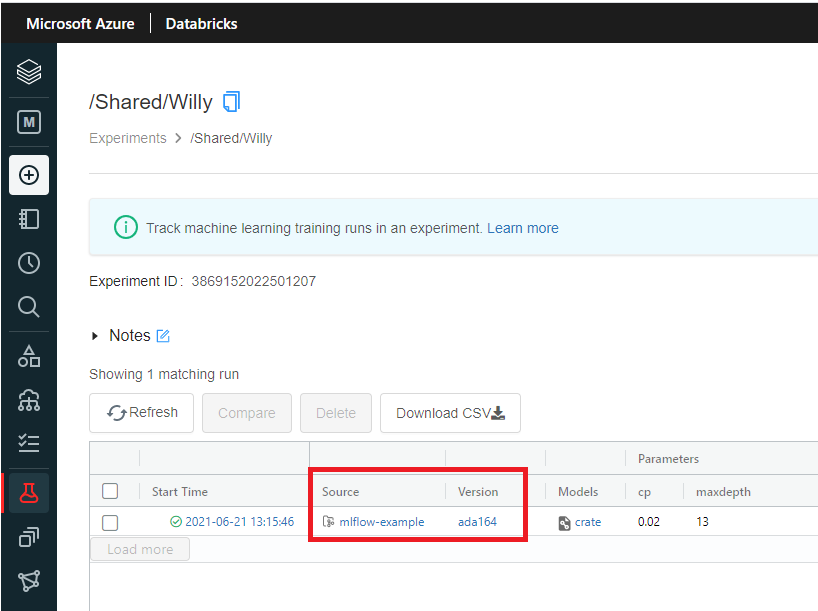

## MLflow Projects

### 3.1 Wat is MLflow Projects?
MLflow Projects zorgt er voor dat je runs reproduceerbaar zijn. Niet alleen in je eigen (lokale) omgeving, maar ook in een andere (cloud) omgeving. De reproduceerbaarheid is onafhankelijk van het onderliggende platform.

Met MLflow Projects is het ook eenvoudig om je runs als job te schedulen. Dat kan bijvoorbeeld handig zijn als het trainen van een model veel rekenkracht vraagt en lang duurt.

### 3.2 MLproject bestand
Een MLflow project heeft meestal een `MLproject` bestand. Het is een [yaml](https://learnxinyminutes.com/docs/yaml/) bestand. In het bestand geef je aan welke code uitgevoerd moet worden en definieer je de parameters. Uitgebreide documentatie vind je [hier](https://www.mlflow.org/docs/latest/projects.html#overview).    

```
name: My Project

entry_points:
  main:
    parameters:
      cp: {type: float, default: 0.05}
      maxdepth: {type: int, default: 3}
    command: "Rscript train.R -P cp={cp} maxdepth={maxdepth}"
```

#### Oefening:
1. Maak het bestand `MLproject` (zonder extensie!) en voeg bovenstaande code toe.
2. Sla het bestand op in de root van je project. 

Let op: in een yaml-bestand luistert de uitlijning nauw!

### 3.3 R code parametriseren
Het doel is om de R code voor het trainen en loggen van een model via de command-line-interface (CLI) uit te voeren, _onafhankelijk van het onderliggende platform_. Parameterwaarden moet je dan ook op de command-line kunnen specificeren. Daarvoor moet je de R code aanpassen.

```
with(mlflow_start_run(), {
  mlflow_param('cp', cp)
  mlflow_param('maxdepth', maxdepth)
  tree <- rpart(
    Species ~ ., 
    data = iris, 
    method = "class", 
    control = rpart.control(cp = cp, maxdepth = maxdepth)
)
  predictor <- carrier::crate(
    function(x) {rpart:::predict.rpart(model, x, type = "class")},
    model = tree
  ) 
  mlflow_log_model(predictor, "model")
})
```
Merk op dat in bovenstaand voorbeeld de functie `mlflow_log_param()` is vervangen door `mlflow_param()`.

#### Oefening:
1. Maak het bestand `train.R` aan en voeg bovenstaande code toe. Sla het bestand op in de root van je project.
2. Bekijk de documentatie van de functie [`mlflow_param()`](https://www.rdocumentation.org/packages/mlflow/versions/1.14.0/topics/mlflow_param). 
3. Specificeer default waarden voor de parameters, zodat de code ook werkt wanneer die niet via de CLI wordt aangeroepen.

### 3.4 MLflow project uitvoeren

Het CLI-commando om het project uit te voeren en het model te trainen is:

```
mlflow run . -P cp=0.05 maxdepth=3
```

Jammer genoeg is het in RStudio Cloud om security redenen niet mogelijk rechtstreeks gebruik te maken van de CLI. 

Maar het is w&eacute;l mogelijk om de CLI te gebruiken vanuit de R console met behulp van de _wrapper_ functie `mlflow_run()`.


```
mlflow_run(
  uri = '.', 
  experiment_id = <jouw experiment id>, 
  parameters = list(cp = 0.01, maxdepth = 20), 
  no_conda = TRUE
)
```

Hierbij wordt automatisch het `MLproject` bestand in de root van je werkdirectory (`uri = '.'`) ingelezen.

#### Oefening:
1. Cre&euml;er een run en train en log een model door het uitvoeren van `mlflow_run()`.
2. Check in de MS Azure Databricks omgeving dat er een run aan je experiment is toegevoegd en een model is gelogd.
3. Voer stap 1 nogmaals uit, maar nu met `no_conda = FALSE`. Wat is het verschil? Wanneer gebruik je deze parameter?

### 3.5 Code op GitHub gebruiken

In de praktijk gebruik je natuurlijk git voor versiebeheer. Voordat je een nieuwe run aanmaakt en het model traint en logt, push je de code eerst naar een git server, bijvoorbeeld naar Bitbucket of GitHub. Vervolgens geef je de URI van de repository mee in je functieaanroep.

```
mlflow_run(
  uri = "https://github.com/friesewoudloper/mlflow-example", 
  experiment_id = <id van jouw experiment>, 
  parameters = list(cp = 0.02, maxdepth = 13), 
  no_conda = TRUE
)
```

#### Oefening:
1. Bekijk de voorbeeld repository https://github.com/friesewoudloper/mlflow-example.
2. Cre&euml;er een run en train en log een model door `mlflow_run()` aan te roepen met de URI van de GitHub repository als argument.
3. Ga naar de MS Azure Databricks omgeving. Merk op dat nu ook een verwijzing naar de broncode op GitHub is toegevoegd aan de metadata.




### 3.6 Berekeningen uitvoeren op een Databricks cluster

Meestal schrijf je de code voor het trainen van een model eerst op een kleine subset van de data. Pas als je zeker weet dat er geen fouten meer in de code zitten, train je je model op de volledige training set. Dit kan uren, soms wel dagen duren. Als het trainen veel rekenkracht vraagt, kun je er voor kiezen om een Databricks job aan te maken. De berekeningen vinden dan plaats op een Databricks cluster. Niet lokaal, maar _in de cloud_. 

Je moet eerst wel de specificaties van het Databricks cluster toevoegen aan je MLflow project. Dat doe je met behulp van een JSON-bestand.

```
{
  "spark_version": "7.3.x-scala2.12",
  "num_workers": 1,
  "node_type_id": "Standard_DS3_v2"
}
```
Een Databricks job kun je aanmaken en starten met `mlflow_run()`. In de functieaanroep specificeer je Databricks als backend en geef je aan wat het pad is naar het bestand met de clusterspecificatie. 

```
mlflow_run(
  uri = "https://github.com/friesewoudloper/mlflow-example", 
  experiment_id = <id van jouw experiment>, 
  parameters = list(cp = 0.02, maxdepth = 13),
  backend = "databricks",
  backend_config = "cluster-spec.json"
)
```

Helaas hebben we voor de workshop niet genoeg MS Azure _credits_ om dit zelf uit te proberen.

#### Oefening
Beantwoord de volgende vraag: Wat zijn zaken die extra aandacht vragen wanneer je je model traint op een MS Azure Databricks cluster?
