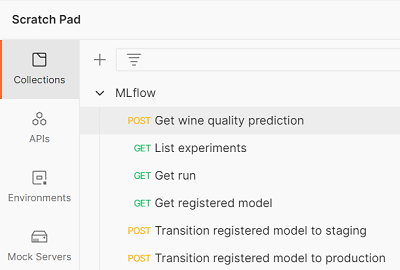

## MLflow Models & Model registry

### 3.1 Wat is een MLflow Model?
Een MLflow Model is een model opgeslagen in een standaard formaat. Het is een specifieke opslagconventie. Een MLflow Model kan gebruikt worden door andere tools, bijvoorbeeld voor het maken van real-time voorspellingen via een REST API. MLflow Models biedt een oplossing voor _model packaging_ en zorgt zo voor _portabiliteit_.

Een MLflow Model is een directory met tenminste twee bestanden: een `MLmodel` bestand met metadata en een binair bestand met het geserialiseerde model. Het model kan verschillende smaken of _flavors_ hebben. Een flavor is een machine learning toolkit, zoals Scikit-learn of TensorFlow. MLflow biedt [standaard ondersteuning](https://www.mlflow.org/docs/latest/models.html#built-in-model-flavors) voor een beperkt aantal flavors, maar je kunt de lijst ook uitbreiden met je eigen 'smaakjes'.

#### Oefening:
1. Ga naar de MS Azure Databricks omgeving. Open een run uit één van de vorige oefeningen waarin je een model in R gelogd hebt. Bekijk de artifacts.
2. Inspecteer de metadata van het model. Wat voor flavor heeft het model?
4. MLflow biedt standaard geen ondersteuning voor [PMML](https://en.wikipedia.org/wiki/Predictive_Model_Markup_Language). Sommige organisaties leveren hun modellen op in PMML-formaat. Betekent dit dan dat zij geen gebruik kunnen maken van MLflow Models en de Model Registry?

### 3.2 Wat is de MLflow Model Registry?

De MLflow Model Registry is een centrale opslag ter ondersteuning van de hele levenscyclus van een MLflow model. De MLflow Model Registry zorgt voor:
* _model lineage_ (herleidbaarheid van een model naar een experiment, run en versie van de code), 
* _model versioning_, 
* _model stage transitions_ (gecontroleerde faseovergangen, bijvoorbeeld van _staging_ naar _productie_),
* _model metadata_.    

De MLflow Model Registry biedt ondersteuning voor _model management_. Het bevat de modellen die in de experimenten uiteindelijk als beste uit de bus zijn gekomen en verder gaan in de cyclus, naar de pilot- of testfase en uiteindelijk misschien wel naar productie.

### 3.3 Model management

MLflow heeft een [R API](https://www.mlflow.org/docs/latest/R-api.html) en een [Python API](https://www.mlflow.org/docs/latest/python_api/index.html). Jammer genoeg is de R API niet zo rijk als de Python API. Functies voor het registereren van een model en het pushen van staging naar productie zijn bijvoorbeeld niet beschikbaar in R. Maar gelukkig kun je in de RStudio IDE ook Python code uitvoeren. Een Python bestand maak je aan via _File_ > _New File_ > _Python Script_.

Met onderstaande Python code registreer je een model. De naam van het model mag je zelf kiezen.

```
import mlflow
from mlflow.tracking import MlflowClient
client = MlflowClient()
client.create_registered_model("<jouw-model>")
```

Vervolgens kun je de eerste versie van je model toevoegen aan de model registry. Hiervoor heb je de volgende parameters nodig:
* de naam van het geregistreerde model,
* het run id,
* de locatie (URI) van het MLflow model.

De model URI ziet er bijvoorbeeld zo uit: `dbfs:/databricks/mlflow-tracking/3869152022501207/d764dc6b2e4a4bc5b8fc609fe3ce11b3/artifacts/model`.
Als je het run id weet, kun je de model URI opzoeken in de gebruikersinterface van MLflow, met de R functie `mlflow_list_artifacts()`of met de Python functie `list_artifacts()`.

```
result = client.create_model_version(
    name = "<jouw-model>",
    run_id = "<run id>",
    source = "<model URI>"
)
```

Je kunt ook metadata toevoegen, bijvoorbeeld een beschrijving van het model.

```
client.update_model_version(
    name = "<jouw-model>",
    version = 1,
    description = "<beschrijving van het model>"
)
```

Een versie van een model kan zich in verschillende fases bevinden: `None`, `Staging`, `Production` of `Archived`. Met onderstaande code push je een versie naar `Staging`.

```
client.transition_model_version_stage(
    name = "<jouw-model>",
    version = 1,
    stage = "Staging"
)
```

Je kunt een model ook weer verwijderen.

```
client.delete_registered_model(
    name = "<jouw-model>"
)
```

#### Oefening
1. Registreer een nieuw model.
2. Creëer een eerste versie van een model. Kies een MLflow model dat door jou of een collega in één van de vorige oefeningen is aangemaakt.
3. Voeg een beschrijving toe.
4. Push het model naar `Production`. 
5. Verwijder het model. Waarschijnlijk krijg je een foutmelding. Waarom krijg je deze melding en wat moet je eerst doen om het model vervolgens toch te kunnen verwijderen?

### 3.4 Model deployment

Uiteindelijk wil je een model _deployen_, zodat je het kunt gebruiken voor het maken van voorspellingen. Daarbij kun je onderscheid maken in: 
* _offline_ of _batch_ predicties en
* _online_ of _real-time_ predicties. 

Voor offline predicties biedt MLflow een oplossing gebaseerd op Spark. Omdat we maar beperkt de tijd hebben, gaan we hier tijdens de hackathon niet verder op in.

Voor online predicties kun je met behulp van de MLflow Scoring Server een REST API beschikbaar stellen. Een REST API is een lichtgewicht oplossing voor het ontsluiten van een model. Voor de afnemers van het model is de technische implementatie niet relevant. Ze moeten alleen weten hoe ze met het model kunnen communiceren via de REST interface, verder niets.

In de MS Azure Databricks omgeving voor de hackathon staat een MLflow model dat de kwaliteit van wijn voorspelt op basis van een aantal kwantitatieve variabelen. Hier ga je zo een aantal oefeningen mee doen. Het model is getraind in Python met Scikit-learn. Het is gepubliceerd als REST API door de MLflow Scoring Server. 

> Helaas kunnen we niet laten zien hoe je een model in R met MLFlow via een REST API beschikbaar stelt. Volgens de [documentatie](https://www.mlflow.org/docs/latest/tutorials-and-examples/tutorial.html#conda-example) kan dit wel, maar het is ons tijdens de voorbereiding van de hackathon niet gelukt.
> Andere organisaties lopen tegen [hetzelfde probleem](https://forums.databricks.com/questions/55512/support-for-serving-r-models-through-model-registr.html?childToView=64907) aan. Inmiddels hebben we er een [GitHub issue](https://github.com/mlflow/mlflow/issues/4529) voor aangemaakt.

In de oefeningen maak je ook gebruik van Postman. Postman is een handige tool voor het uitproberen en testen van REST API's. Een Postman collectie is een verzameling API requests. Speciaal voor de hackathon hebben we ook een Postman collectie gemaakt. De collectie bevat alle requests die in dit deel van de hackathon voorbij komen.

#### Oefening
1. Ga naar de MS Azure Databricks omgeving. Zoek de model URL's op voor `tech-summit-wine-model`. Waarom zijn er twee? Wanneer gebruik je welke URL?
2. Bekijk het dataschema. Wat zijn de in- en outputs van het model? 
3. Open Postman. Open de _MLflow_ collectie. Open het _Get wine quality prediction_ request. Verstuur het request. Bekijk de respons.



4. Je kunt de REST API natuurlijk ook aanroepen vanuit R. Probeer onderstaande code uit om te kijken hoe dat gaat.

```
library(httr)

key <- Sys.getenv("DATABRICKS_TOKEN")
base_url <- Sys.getenv("DATABRICKS_HOST")
path <- "/model/tech-summit-wine-model/Production/invocations"
body <- list(
  alcohol = 12.8, 
  chlorides = 0.029, 
  `citric acid` = 0.48, 
  density = 0.98, 
  `fixed acidity` = 6.2, 
  `free sulfur dioxide` = 29, 
  pH = 3.33, 
  `residual sugar` = 1.2, 
  sulphates = 0.39, 
  `total sulfur dioxide` = 75, 
  `volatile acidity` = 0.66
)

pred <- content(
  httr::POST(
    url <- modify_url(base_url, path = path, scheme = "https"),
    body = jsonlite::toJSON(list(body), auto_unbox = TRUE), 
    add_headers(Authorization = paste("Bearer", key)), 
    content_type_json()
  )
)
pred
```
5. Bouw een request dat in één keer voor meerdere observaties een predictie opvraagt. Dat kan in Postman of in R. 
6. Beantwoord de volgende vraag: Wat zijn de voor- en nadelen van een REST API?

#### Oefening (optioneel)
Naast het maken van voorspellingen ontsluit MLflow ook andere functionaliteit via een REST API. Bijna alle functionaliteit die beschikbaar is via de MLflow gebruikersinterface, is &oacute;&oacute;k beschikbaar via de REST API. De Postman collectie bevat een aantal voorbeeldrequests. Probeer ze maar eens uit. Documentatie over de REST API vind je [hier](https://mlflow.org/docs/latest/rest-api.html).
